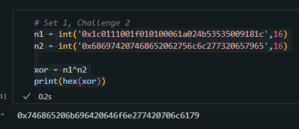

<h1>Challenge</h1>

 We have to xor the hex number `1c0111001f010100061a024b53535009181c` with the hex number `686974207468652062756c6c277320657965` to get the hex number `746865206b696420646f6e277420706c6179`. 

<h1>Solution</h1>

 First we made to integers to represent the two hex numbers. Then we took the bitwise XOR of these two numbers. Lastly, we print the hex number result. 

