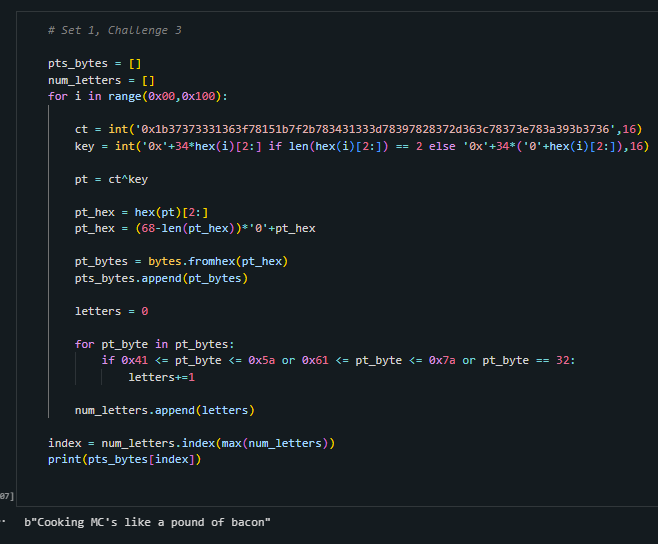

<h1>Challenge</h1>

 We are given the hex ciphertext `1b37373331363f78151b7f2b783431333d78397828372d363c78373e783a393b3736` that
has been encrypted with single character XOR. We need to find the plaintext. 

<h1>Solution</h1>

 First we intialize two empty arrays one for plaintext bytes `pts_bytes` and one for the corresponding amount of letters in these plaintexts `num_letters`. Then we iterate through every possible key. Then in this loop, we intialize the ciphertext `ct` as an integer and make the key an integer as well. Then we take the XOR of the cipher text and key to find a possible plaintext `pt`. Once we find the plaintext, we padd it and append it to our plaintext bytes array `pts_bytes`. Then we count the letters in spaces in the plaintext and append that number to num_letters. Lastly, after the loop we look for the plaintext with the most letters and spaces which is our plaintext.

