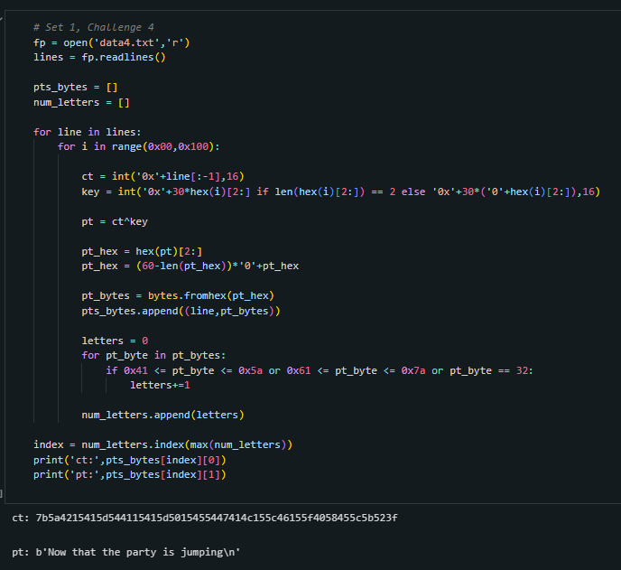

<h1>Challenge</h1>
 We are given a list of possible ciphertexts and need to figure out which one has been encrypted using single character XOR. 

<h1>Solution</h1>
  First we load and read the data. Then we intialize two empty arrays one for plaintexts represented by bytes `pts_bytes` and one for the corresponding number of letters (and spaces) in these plaintexts `num_letters`. Then we iterate over every possible ciphertext and every possible key. For each possible ciphertext and key we turn the ciphertext line into an integer and the key into an integer. Then we XOR the possible ciphertext and the possible key. Now we transform it to a hex string and pad it. Then we change it to bytes. Finally we count the letters in the possible plaintext resulting from the possible ciphertext and key. Lastly, we add this value and the plaintex bytes to an array. We do this for every possible key and plaintext. Now at the end, we see which possible ciphertext and key combination yielded the most letters and that is our ciphertext, key, and plaintext. 
