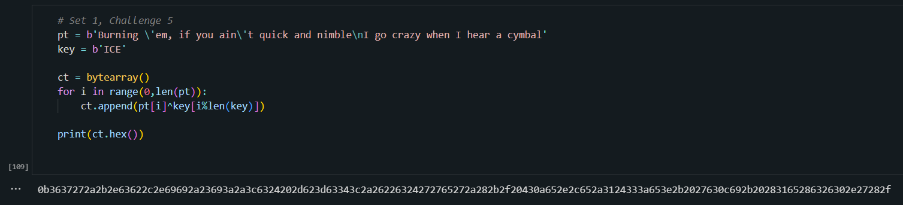

<h1>Challenge</h1>
 We need to encrypt `Burning 'em, if you ain't quick and nimble  I go crazy when I hear a cymbal' with the key `ICE` using key repeating XOR. 

<h1>Solution</h1>
 First we save the string we are encrypted as bytes and do the same for the key. Then we loop through the bytes and and xor the `i-th` byte of the ciphertext with the `i%KEYLEN` byte of the key. 

