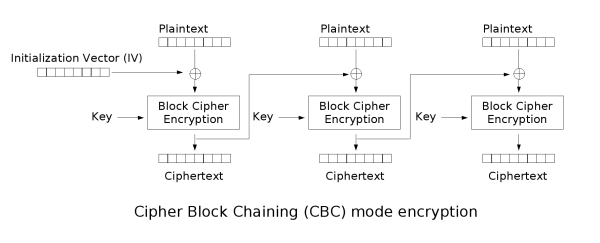

# Challenge

The challenge wants us to decrypt ciphertext that has been encrypted using AES CBC mode.

# CBC Mode

CBC mode encryption breaks the plaintext into plaintext blocks. Each plaintext block is xored with the previous resulting ciphertext block before it is encrypted except for the first plaintext block which is xored with the iv. The ciphertext blocks are then joined to create the ciphertext.


# Solution

First we import necessary imports

````Python
from Crypto.Cipher import AES
import base64
````

Then we read and decode the ciphertext.

````Python
fp = open('set2/c10/data10.txt')
ct = base64.b64decode(fp.read())
````

We save the key and iv as bytes. Then we create the cipher object.

````Python
key = b'YELLOW SUBMARINE'
iv = b'\x00' * AES.block_size

cipher = AES.new(key, AES.MODE_ECB)
````

Set the plaintext as empty and the prev block as the iv.

````Python
pt = b''
prev = iv
````

Now loop through the blocks and for each block decrypt it and then xor it with the previous ciphertext block. Finally add this plaintext block `pt_block` to the plaintext `pt`.

````Python
for i in range(0,len(ct),AES.block_size):
  
    block = ct[i:i+AES.block_size]
  
    temp = cipher.decrypt(block)
  
    pt_block = bytes(a ^ b for a, b in zip(prev,temp))
    pt+=pt_block

    prev = block
````

Finally print the resulting plaintext `pt`.

````Python
print(pt.decode())
````

The resulting plaintext is

````
I'm back and I'm ringin' the bell 
A rockin' on the mike while the fly girls yell 
In ecstasy in the back of me 
Well that's my DJ Deshay cuttin' all them Z's 
Hittin' hard and the girlies goin' crazy 
Vanilla's on the mike, man I'm not lazy. 

I'm lettin' my drug kick in 
It controls my mouth and I begin 
To just let it flow, let my concepts go 
My posse's to the side yellin', Go Vanilla Go!

Smooth 'cause that's the way I will be
And if you don't give a damn, then
Why you starin' at me
So get off 'cause I control the stage
There's no dissin' allowed
I'm in my own phase
The girlies sa y they love me and that is ok
And I can dance better than any kid n' play

Stage 2 -- Yea the one ya' wanna listen to
It's off my head so let the beat play through
So I can funk it up and make it sound good
1-2-3 Yo -- Knock on some wood
For good luck, I like my rhymes atrocious
Supercalafragilisticexpialidocious
I'm an effect and that you can bet
I can take a fly girl and make her wet.

I'm like Samson -- Samson to Delilah
There's no denyin', You can try to hang
But you'll keep tryin' to get my style
Over and over, practice makes perfect
But not if you're a loafer.

You'll get nowhere, no place, no time, no girls
Soon -- Oh my God, homebody, you probably eat
Spaghetti with a spoon! Come on and say it!

VIP. Vanilla Ice yep, yep, I'm comin' hard like a rhino
Intoxicating so you stagger like a wino
So punks stop trying and girl stop cryin'
Vanilla Ice is sellin' and you people are buyin'
'Cause why the freaks are jockin' like Crazy Glue
Movin' and groovin' trying to sing along
All through the ghetto groovin' this here song
Now you're amazed by the VIP posse.

Steppin' so hard like a German Nazi
Startled by the bases hittin' ground
There's no trippin' on mine, I'm just gettin' down
Sparkamatic, I'm hangin' tight like a fanatic
You trapped me once and I thought that
You might have it
So step down and lend me your ear
'89 in my time! You, '90 is my year.

You're weakenin' fast, YO! and I can tell it
Your body's gettin' hot, so, so I can smell it
So don't be mad and don't be sad
'Cause the lyrics belong to ICE, You can call me Dad
You're pitchin' a fit, so step back and endure
Let the witch doctor, Ice, do the dance to cure
So come up close and don't be square
You wanna battle me -- Anytime, anywhere

You thought that I was weak, Boy, you're dead wrong
So come on, everybody and sing this song

Say -- Play that funky music Say, go white boy, go white boy go
play that funky music Go white boy, go white boy, go
Lay down and boogie and play that funky music till you die.

Play that funky music Come on, Come on, let me hear
Play that funky music white boy you say it, say it
Play that funky music A little louder now
Play that funky music, white boy Come on, Come on, Come on
Play that funky music
♦♦♦♦
````
