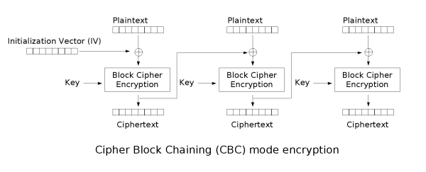

# Challenge

The challenge wants us to making an encryption oracle that makes a 16 byte random key and encrypts AES with ECB half of the time and CBC the other half of the time. It also wants us to detect which type of encryption is being used.

# Encryption Oracle

For plaintext `pt` we first make a random key of 16 bytes. Then we make a random prefix `pre` and suffix `suf` of between 5 and 10 bytes. Then we put the prefix `pre`, plaintext `pt`, and suffix `suf` together: `pre+pt+suf`. Next we pad the plaintext. Then we choose ECB mode half of the time and CBC mode the other half of the time. If it's ECB mode we encrypt using the AES cipher in ECB mode and our key we generated earlier. If it's CBC we make a random iv that's the size of AES blocksize. THen we encrypt using the AES cipher in CBC mode, they random iv we just generated, and our key we generated earlier.

````Python
def encryption_oracle(pt):

    key = Crypto.Random.get_random_bytes(16)

    pre = Crypto.Random.get_random_bytes(Crypto.Random.random.randrange(5,11))
    suf = Crypto.Random.get_random_bytes(Crypto.Random.random.randrange(5,11))
    pt = pre+pt+suf
    pt = pad(pt, AES.block_size)
    mode = Crypto.Random.random.randint(0,1)

    ct = None

    if mode == 0:

        cipher = AES.new(key, AES.MODE_ECB)
        ct = cipher.encrypt(pt)

    elif mode == 1:

        iv = Crypto.Random.get_random_bytes(AES.block_size)
        cipher = AES.new(key, AES.MODE_CBC,iv)

        ct = cipher.encrypt(pt)

    return ct, mode
````

# Detection

We know that both AES ECB and CBC break the  plaintext up into blocks. ECB encrypts each ciphertext block and chains these encrypted blocks together while CBC xors the plaintext block with the previous ciphertext block or iv and then encrypts it.



We know that we can detect ECB over CBC if the plaintext blocks repeat because the resulting ciphertext blocks will also repeat with ECB but not with CBC. First we set repetitions `rep` to 0. Then we loop through each ciphertext block twice, then if the indicies of the blocks aren't the same and the ciphertext block is the same we increase reptitions `rep` by 1. If any of the ciphertext blocks are the same, it's likely ecb mode and if none of them are the same it may be cbc mode. However, this all relies on the fact that the plaintext repeats.

````Python
def detect(ct):

    rep = 0

    for i in range(0,len(ct),AES.block_size):

        for j in range(0,len(ct),AES.block_size):

            if i != j and ct[i:i+AES.block_size] == ct[j:j+AES.block_size]:
              
                rep+=1

    return 'cbc' if rep == 0 else 'ecb'
````
